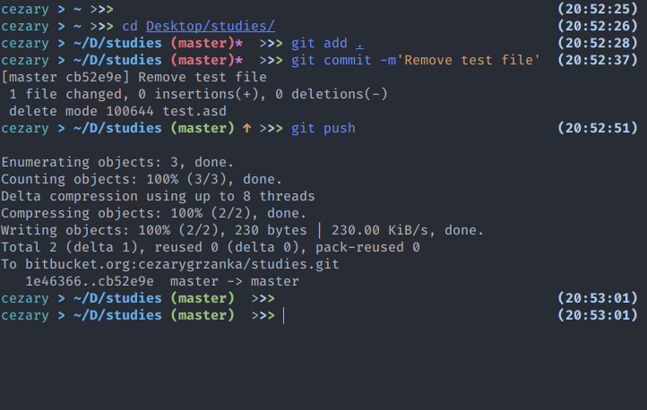

#### Wanna fish theme

> A theme for [Oh My Fish][omf-link]
> by Cezary Grzanka

[](/LICENSE)
[](https://fishshell.com)
[](https://www.github.com/oh-my-fish/oh-my-fish)

## With Oh-My-Fish

### Download

```sh
$ omf dir: ~/.local/share/omf
$ git clone https://github.com/Grzanka99/wanna-fish-theme.git ~/.local/share/omf/themes/wanna
$ # Enabling
$ omf reload
$ omf theme wanna
```

## With clear fish

If you want to install this theme in clear fish, you have to close this repository into functions directory inside fish config directory.
e.g.:

```
$ # config dir: ~/.config/fish/
$ git clone https://github.com/Grzanka99/wanna-fish-theme.git ~/.config/fish/functions
```

If you have any other files inside `functions` directory, you have to move this files manualy:

```
fish_prompt.fish
fist_right_prompt.fish
```

## Features

- git repository support
- shortcut of full path
- nice look :P

## Screenshot



# License

[MIT][mit] © [Cezary Grzanka][author] et [al][contributors]

[mit]: https://opensource.org/licenses/MIT
[author]: https://github.com/Grzanka99
[contributors]: https://github.com/Grzanka99/wanna-fish-theme/graphs/contributors
[omf-link]: https://www.github.com/oh-my-fish/oh-my-fish
[license-badge]: https://img.shields.io/badge/license-MIT-007EC7.svg?style=flat-square
